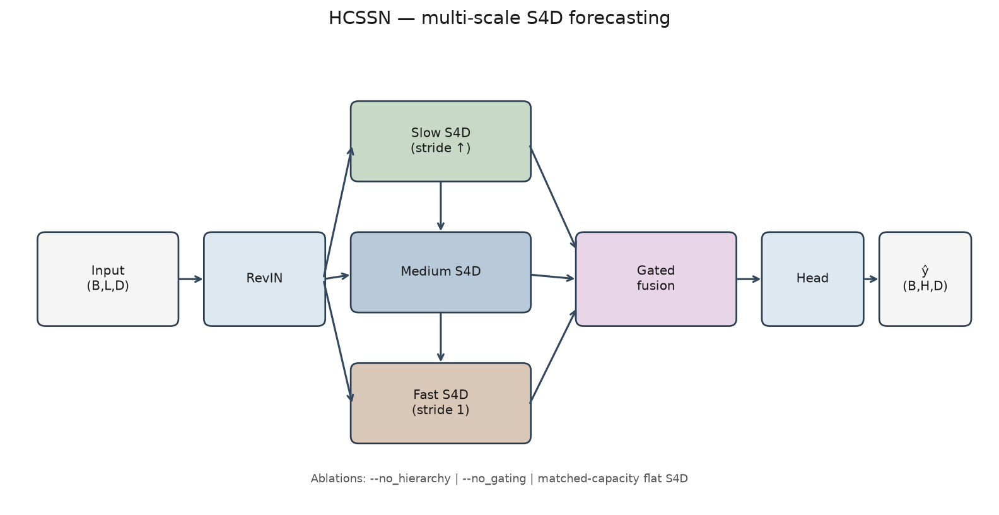

# HCSSN

Multi-scale state-space model for multivariate time-series forecasting.

RevIN → parallel slow / medium / fast S4D stacks → gated fusion → linear head. Built for ablation studies against a parameter-matched flat S4D baseline.



## Setup

```bash
python -m venv .venv && source .venv/bin/activate
pip install -r requirements.txt
```

Place ETT / Weather CSVs under `data/` (or pass an absolute `--data` path). Shared copies may already live at `../data/`.

## Train

```bash
# hierarchical model
python train.py --data ../data/ETTh1.csv --context 336 --horizon 96 --epochs 50 --save_dir checkpoints/full

# matched-capacity flat S4D (ablation)
python train.py --data ../data/weather.csv --context 336 --horizon 96 \
  --no_hierarchy --hidden_dim 192 --n_ssm_layers 6 --lr 3e-4 --save_dir checkpoints/flat
```

Useful flags: `--no_hierarchy`, `--no_gating`, `--no_revin`, `--decode_all_scales`, `--chain_gates`, `--inject_film`.

## Results

Protocol: lookback 336, horizon 96, train-only z-score, chronological splits. Full numbers in [`results/summary.json`](results/summary.json).

**ETT (seed 42)**

| Dataset | MSE  | MAE  |
|---------|------|------|
| ETTh1   | 0.451 | 0.502 |
| ETTh2   | 0.388 | 0.460 |
| ETTm1   | 0.416 | 0.487 |
| ETTm2   | 0.449 | 0.440 |

**Weather ablation (3 seeds)** — hierarchy vs matched-capacity flat S4D:

| Setting     | Full MSE | Matched flat MSE | Hierarchy wins? |
|-------------|----------|------------------|-----------------|
| lr = 1e-3   | 0.159    | 0.159            | No (tie / noise)|
| lr = 3e-4   | 0.160    | 0.158            | No              |

Fusion gates often collapse onto the fast scale. Treat this repo as a reproducible multiscale SSM stack and ablation harness, not as a claim that hierarchy beats flat S4D.

## Layout

```
train.py          # training + CLI
src/model.py      # S4D, hierarchy, fusion
src/data.py       # chronological loaders
src/metrics.py
results/summary.json
figures/architecture.png
```

## Stack

PyTorch · NumPy · Pandas
